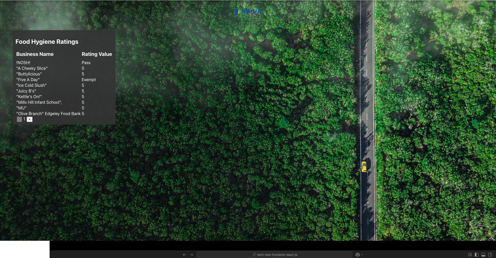

# aviva-zero-tech-test-react-js

This is the Aviva Zero React Tech Test in JavaScript.

## Requirements

- NPM [(more info)](https://docs.npmjs.com/downloading-and-installing-node-js-and-npm)
- Access to the Internet
- Suitable development environment

## Getting Started

- Run it: `npm start`
- Test it: `npm test`
- Build it: `npm run build`
